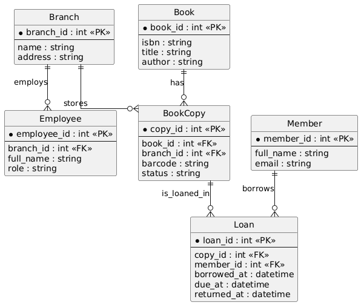

# Databases Fundamentals & Data Modeling

# Databases

## Table of Contents
[0- History of Data & Datasets](#history)  
[1- What is a database & why do we need it?](#whatwhy)  
[2- What is DBMS & its types](#dbms)  
[3- Relational DBMS](#rdbms)  
[4- ACID Properties](#acid)  
[5- Database Modeling](#model)

---

## 0) History of Data & Datasets

Before computers existed, humans were already dealing with the same problem we have today:

**How do we remember information reliably?**

### Ancient Humans
The earliest “databases” were physical records.

- Prehistoric humans carved symbols on rocks and cave walls.
- Ancient civilizations (Egyptians, Sumerians, Babylonians) recorded:
  - taxes
  - trade
  - crops
  - population counts

For example:
Ancient Egyptians used papyrus records to track grain storage and distribution.  
This was essentially a manual data storage system.

The problem?
Searching was slow.
Updating was hard.
Errors were common.

---

### Paper Era
Later, humans invented structured record systems:

- ledgers
- registries
- census books
- accounting books

Banks, governments, and merchants kept large handwritten tables.  
These tables already looked like what we now call **rows and columns**.

But they had major issues:
- one copy only
- easy to lose
- hard to scale
- impossible to search quickly

---

### Early Computers (1950s–1960s)
When computers appeared, data was stored in:

- punch cards
- magnetic tapes

Each program owned its own files.  
This is called the **file-based system**.

Problem:
Every application stored its own data separately.

This caused:
- duplication
- inconsistency
- no shared access

If payroll updated an employee salary, HR might still have the old value.

This is the exact problem databases were invented to solve.

---

### The Relational Revolution (1970s)

In 1970, **Edgar F. Codd** published a famous research paper:

> "A Relational Model of Data for Large Shared Data Banks"

He introduced a new idea:

Instead of programs controlling data,  
**data should be organized mathematically into relations (tables).**

This became the **Relational Database Model**.

Key improvements:
- shared data
- less duplication
- structured queries
- independence from application code

This led to systems like:
- IBM System R
- Oracle (1979)
- later MySQL and PostgreSQL

For the first time, databases became a core part of software systems.

---

### The Internet Era & The .com Boom (1995–2005)

With the rise of the internet, websites suddenly had:

- millions of users
- massive traffic
- continuous writes

Relational databases struggled to scale horizontally.

Companies like Google, Amazon, and Facebook needed:
- distributed storage
- faster writes
- flexible schemas

This led to **NoSQL databases**.

Examples:
- key-value stores
- document databases
- column stores

The goal shifted from:
**perfect structure → massive scalability**

---

### Modern Era AI and Vector Databases

Today we have a new type of data:

Not numbers.  
Not text records.

**Embeddings.**

AI systems store vectors representing:
- sentences
- images
- audio
- documents

We now need databases that can answer:
> “Find data similar to this meaning.”

This created **Vector Databases**:
- similarity search
- nearest neighbor search
- semantic retrieval

They are heavily used in:
- search engines
- recommendation systems
- LLM applications (RAG systems)

---

### The Current Database Landscape

Databases are no longer just SQL vs NoSQL.

According to [DB-Engines ranking](https://db-engines.com/en/ranking):
- 15+ database categories exist
- 400+ database systems exist

Each database is optimized for a specific problem.

There is no “best database”
only the **best database for a use case**.

---

## 1) What is a Database?

A **database** is a structured collection of data organized so it can be easily stored, retrieved, and updated.

Think of it as:
an organized memory for a program.

Instead of random files, a database lets software:
- store information
- search quickly
- update safely
- share data between many users

### Why not just files or Excel?

Problems with files:
- duplicated data
- no integrity checks
- corruption risk
- concurrency issues
- security problems

Databases solve:
- Data organization
- Fast retrieval
- Accuracy
- Multi-user access
- Permissions & security

### Real uses
- E-commerce websites
- banking systems
- HR systems
- social media
- games

---

## 2) What is a DBMS?

A **Database Management System (DBMS)** is the software that manages a database.

It acts as a middle layer between:

User / Application  →  DBMS  →  Stored Data

The DBMS:
- stores data
- retrieves data
- prevents conflicts
- enforces rules

You can think of it as:
a very smart file system specialized for structured data.

the main mission of DBMS is to provide an efficient and reliable way to store, retrieve, and manage data:   
here is the simplest example of a dbms (from designing data intensive applications book):

and acctual databases includes millions lines of code here is an example for dbms architecture:

### DBMS Types

Databases are not only SQL vs NoSQL.

Common models and real-world examples:

1. **Relational (tables)**  
   Structured tables with rows and columns and strong consistency.  
   Example: PostgreSQL  
   https://www.postgresql.org/

2. **Document Database**  
   Stores flexible JSON-like documents instead of fixed schemas.  
   Example: MongoDB  
   https://www.mongodb.com/

3. **Column-Family Store**  
   Designed for massive distributed data and analytics workloads.  
   Example: Apache Cassandra  
   https://cassandra.apache.org/

4. **Graph Database**  
   Optimized for relationships (social networks, recommendations, fraud detection).  
   Example: Neo4j  
   https://neo4j.com/

5. **In-Memory Database**  
   Stores data directly in RAM for extremely fast reads/writes (caching, sessions).  
   Example: Redis  
   https://redis.io/

6. **Vector Database**  
   Stores embeddings and performs similarity search (AI, semantic search, RAG systems).  
   Example: Qdrant  
   https://qdrant.tech/

Each database type exists because different data problems require different storage designs.
---

## 3) Relational DBMS

A **Relational Database (RDBMS)** stores data in tables.

Introduced by Edgar F. Codd (1970).

Data structure:
- Tables
- Rows (records)
- Columns (attributes)

Key idea:
Data is connected through relationships.

### Core Components
- Table
- Row
- Column
- Primary Key
- Foreign Key
- Relationships

Example:
An employee belongs to a department.
We reference the department instead of repeating its data.

---

## 4) ACID Properties

ACID guarantees database reliability.

### Atomicity
Transaction happens completely or not at all.

### Consistency
Database rules are never violated.

### Isolation
Multiple users don’t corrupt each other’s work.

### Durability
Once saved it will not be lost even after crash.

---

## 5) Database Modeling

Database modeling is planning the structure of stored data.

### Steps

#### 1) Requirement Analysis
Understand what data exists and what relationships exist.

#### 2) Conceptual Modeling (ERD)
Draw an Entity Relationship Diagram showing entities and relationships.

#### 3) Logical Modeling
Convert ERD into tables, columns, and keys.

#### 4) Normalization
Remove redundancy and ensure integrity.

Goal:
Store data once and reference it everywhere.

#### 5) Physical Modeling
Define indexes, data types, and storage implementation.

---

## Library Borrowing System: Modeling Example

Imagine you are designing a database for a **Library System** that has:
- **Multiple branches**
- **Employees** working at each branch
- **Members** (borrowers)
- **Books** (with multiple copies across branches)
- **Borrowing / Returning** transactions

We will design it step-by-step like a real database engineer.

---

## Modeling Steps

### 1) Requirement Analysis
Goal: fully understand **what to store** and **what questions the system must answer**.

Ask questions like:
- How many branches exist? What info per branch (name, address, phone)?
- Employees: do they belong to exactly one branch? What’s their role (librarian, manager)?
- Members: can a member borrow from any branch? Do they have membership start/end dates?
- Books: do we track authors, ISBN, categories?
- Copies: can the same book exist in multiple branches? Do we track condition/status?
- Borrowing rules:
  - max books per member?
  - borrow duration?
  - fines for late returns?
- Do we need reservation/holds? (optional feature)

**Output of this step:** a clear list of required data + required operations.

---

### 2) Conceptual Modeling (ERD)
Goal: identify **entities** + **relationships** (high level, no SQL yet).

**Main Entities**
- Branch
- Employee
- Member
- Book
- BookCopy (physical copy of a book at a branch)
- Loan (borrowing transaction)

**Key Relationships**
- A Branch has many Employees
- A Branch has many BookCopies
- A Book has many BookCopies
- A Member has many Loans
- A Loan links a Member to a specific BookCopy

---

### 3) Logical Modeling (ERD → Relational Tables)
Goal: convert ERD into **tables + columns + keys**.

Here is a clean relational design:

#### `branches`
- `branch_id` (PK)
- `name`
- `address`
- `phone`

#### `employees`
- `employee_id` (PK)
- `branch_id` (FK → branches.branch_id)
- `full_name`
- `role` (e.g., librarian, manager)
- `hire_date`

#### `members`
- `member_id` (PK)
- `full_name`
- `email` (unique)
- `phone`
- `join_date`
- `status` (active, suspended)

#### `books`
- `book_id` (PK)
- `isbn` (unique)
- `title`
- `author`
- `publisher`
- `publish_year`
- `category`

#### `book_copies`
This table is important: it represents **physical copies** distributed across branches.
- `copy_id` (PK)
- `book_id` (FK → books.book_id)
- `branch_id` (FK → branches.branch_id)
- `barcode` (unique)
- `status` (available, loaned, lost, maintenance)
- `condition_note` (optional)

#### `loans`
A loan is a borrowing event.
- `loan_id` (PK)
- `copy_id` (FK → book_copies.copy_id)
- `member_id` (FK → members.member_id)
- `issued_by_employee_id` (FK → employees.employee_id)
- `borrowed_at` (datetime)
- `due_at` (datetime)
- `returned_at` (datetime, nullable)
- `return_received_by_employee_id` (FK → employees.employee_id, nullable)

---

### 4) Normalization
Goal: remove redundancy + prevent anomalies.

Examples:
- We don’t store branch address in `employees` (we store `branch_id`).
- We don’t store book title in `loans` (we store `copy_id` → `book_id`).
- If a member changes phone number, we update it once in `members`.

Helpful reference:
https://www.freecodecamp.org/news/database-normalization-1nf-2nf-3nf-table-examples/

---

### 5) Physical Modeling
Goal: plan performance + storage details.

Common decisions:
- Indexes:
  - `books(isbn)`
  - `book_copies(branch_id, status)`
  - `loans(member_id, returned_at)`
  - `loans(copy_id, returned_at)`
- Data types:
  - `borrowed_at`, `due_at`, `returned_at` as DATETIME/TIMESTAMP
- Constraints:
  - `isbn` unique
  - `barcode` unique
  - `returned_at` can be NULL until returned
- Optional partitioning (big systems):
  - partition `loans` by year/month
- you can find a full example of this library system in [library_schema.sql](./library_schema.sql)
---